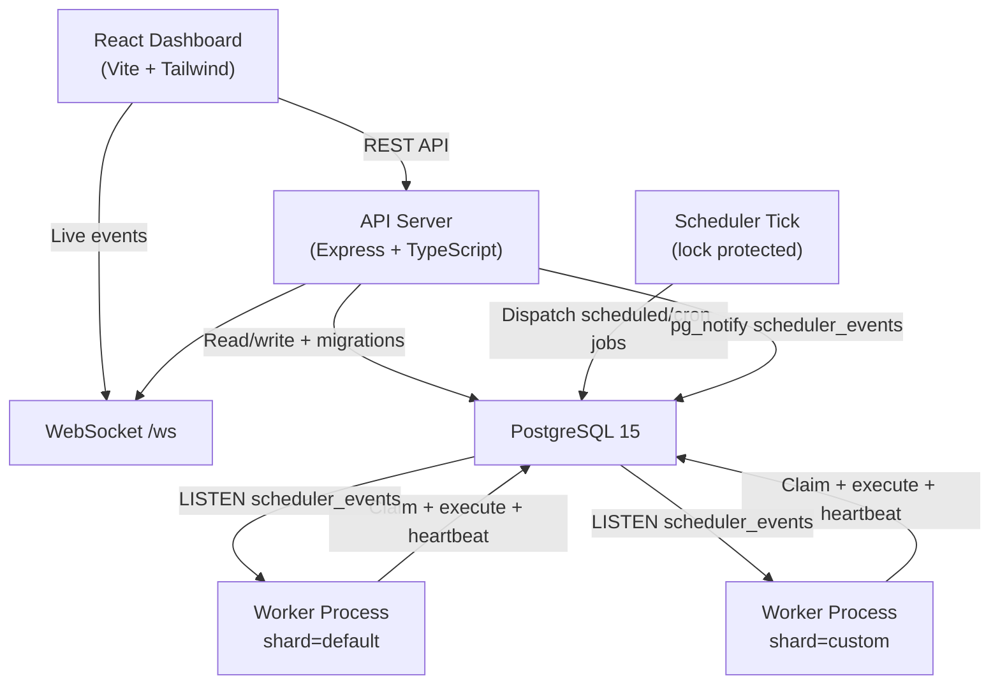
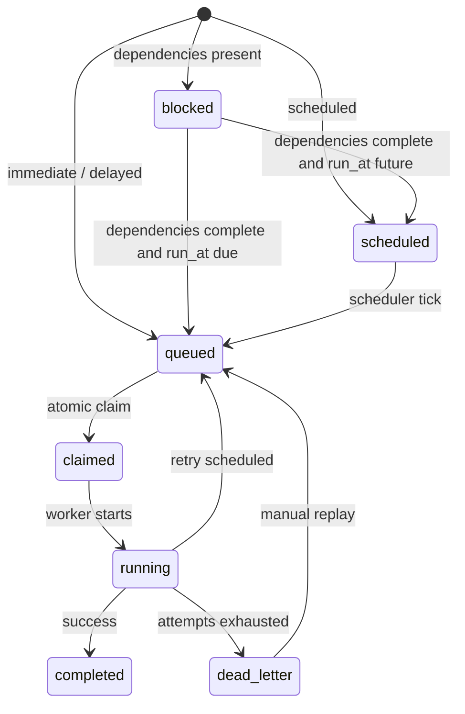

# System Architecture

The Distributed Job Scheduler is a TypeScript, Express, PostgreSQL, worker, and React system built around transactional correctness. PostgreSQL coordinates state, workers claim jobs atomically, and the dashboard receives live updates over WebSocket.

## Components

### API Server

- Handles authentication, projects, queues, jobs, workers, DLQ, retry policies, system events, and RBAC member management.
- Uses Zod validation, structured error responses, JWT auth, rate limiting, and role checks.
- Broadcasts persisted `system_events` to dashboard clients through `/ws`.

### Scheduler

- Runs in the API process.
- Flips due `scheduled` jobs to `queued`.
- Dispatches recurring jobs from `scheduled_jobs`.
- Uses a database-backed distributed lock (`scheduler:tick`) to avoid duplicate dispatch when multiple API instances are running.

### Worker

- Runs as a separate process and can be scaled horizontally.
- Claims jobs with queue-level row locks plus `FOR UPDATE SKIP LOCKED`.
- Filters claims by `WORKER_SHARD_KEY`.
- Uses a per-job distributed lock before execution.
- Sends heartbeats and listens to PostgreSQL `scheduler_events` notifications for event-driven wakeups.

### Dashboard

- Manages projects, queues, jobs, workers, DLQ, metrics, and live system events.
- Supports queue shards, workflow dependency submission, manual retry/replay, and failure summary inspection.
- Uses WebSocket updates plus polling fallback.

## Job Lifecycle

## Bonus Features

- Workflow dependencies: `job_dependencies` blocks dependent jobs until prerequisites complete.
- Rate limiting: `api_rate_limits` tracks request windows.
- Distributed locking: `distributed_locks` protects scheduler ticks and job execution.
- Queue sharding: queues and jobs carry `shard_key`; workers claim their configured shard.
- Event-driven execution: writes to `system_events` also trigger PostgreSQL `NOTIFY`.
- WebSocket live updates: `/ws` streams system events to the dashboard.
- Role-based access control: `organization_members` stores `owner`, `admin`, `operator`, and `viewer`.
- AI-generated failure summaries: terminal failures receive deterministic local triage summaries.
