# ER Diagram

```mermaid
erDiagram
  users ||--o{ organizations : owns
  users ||--o{ organization_members : has_role
  organizations ||--o{ organization_members : grants
  organizations ||--o{ projects : contains
  projects ||--o{ queues : owns
  retry_policies ||--o{ queues : configures
  queues ||--o{ jobs : contains
  queues ||--o{ batches : groups
  batches ||--o{ jobs : contains
  queues ||--o{ scheduled_jobs : schedules
  queues ||--o{ dead_letter_queue : records
  workers ||--o{ jobs : claims
  workers ||--o{ job_executions : runs
  workers ||--o{ worker_heartbeats : sends
  jobs ||--o{ job_executions : attempts
  jobs ||--o{ job_logs : logs
  jobs ||--o{ dead_letter_queue : fails_into
  jobs ||--o{ job_dependencies : dependent_job
  jobs ||--o{ job_dependencies : prerequisite_job

  batches {
    uuid id PK
    uuid queue_id FK
    int total_jobs
    int completed_jobs
    int failed_jobs
    text status
    text callback_url
    timestamptz created_at
    timestamptz updated_at
  }

  users {
    uuid id PK
    text email UK
    text password_hash
    text name
    timestamptz created_at
  }

  organizations {
    uuid id PK
    text name
    uuid owner_id FK
    timestamptz created_at
  }

  organization_members {
    uuid org_id PK,FK
    uuid user_id PK,FK
    text role
    timestamptz created_at
  }

  projects {
    uuid id PK
    uuid org_id FK
    text name
    timestamptz created_at
  }

  retry_policies {
    uuid id PK
    text name
    text strategy
    int base_delay_ms
    int max_retries
    int max_delay_ms
    boolean jitter
  }

  queues {
    uuid id PK
    uuid project_id FK
    text name
    int priority
    int concurrency_limit
    uuid retry_policy_id FK
    boolean is_paused
    text shard_key
    timestamptz created_at
  }

  jobs {
    uuid id PK
    uuid queue_id FK
    text type
    jsonb payload
    text status
    int priority
    timestamptz run_at
    int attempts
    int max_attempts
    text idempotency_key
    uuid worker_id FK
    uuid batch_id
    text shard_key
    text failure_summary
    timestamptz created_at
    timestamptz updated_at
  }

  job_dependencies {
    uuid job_id PK,FK
    uuid depends_on_job_id PK,FK
    timestamptz created_at
  }

  job_executions {
    uuid id PK
    uuid job_id FK
    uuid worker_id FK
    int attempt_number
    text status
    timestamptz started_at
    timestamptz finished_at
    text error_message
    jsonb result
  }

  job_logs {
    bigint id PK
    uuid job_id FK
    text level
    text message
    timestamptz created_at
  }

  workers {
    uuid id PK
    text name
    text status
    timestamptz last_heartbeat_at
    timestamptz started_at
  }

  worker_heartbeats {
    bigint id PK
    uuid worker_id FK
    timestamptz heartbeat_at
    int active_job_count
  }

  scheduled_jobs {
    uuid id PK
    uuid queue_id FK
    jsonb job_template
    text cron_expression
    timestamptz next_run_at
    timestamptz last_run_at
    boolean is_active
  }

  dead_letter_queue {
    uuid id PK
    uuid original_job_id FK
    uuid queue_id FK
    jsonb payload
    text failure_reason
    int attempts_made
    text failure_summary
    timestamptz moved_at
  }
```

Supporting infrastructure tables:

- `distributed_locks`: lock ownership and expiry for scheduler ticks and job execution.
- `api_rate_limits`: request counts per identity, route, and minute window.
- `system_events`: persisted event stream for WebSocket live updates and worker wakeups.
